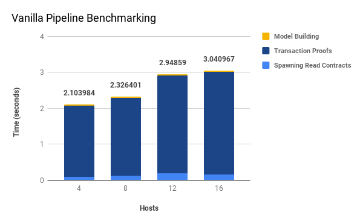

# Vanilla Pipeline
The Vanilla pipeline is a simple application of the [CALYPSO framework](https://github.com/dedis/cothority/tree/master/calypso) for auditable secret sharing.

Please see [README.md](../README.md) for more details about the project as a whole.

## Strategy

In this implementation, a machine learning central node is created. Data are collected via CALYPSO from the data providers and consumed by the machine learning model creator (the data consumer).

## Simulation

We do a simulation using different number of hosts and measure the time it takes to execute different parts of the pipeline.

The dataset used is the [Coimbra Breast Cancer Dataset](../data)
 
 ### Results
 
| hosts | bf | blockinterval | dataset                  | delay | depth | keep | rounds | runwait | servers | suite   | ChildrenWait_system_min | ChildrenWait_system_max | ChildrenWait_system_avg | ChildrenWait_system_sum | ChildrenWait_system_dev | ChildrenWait_user_min | ChildrenWait_user_max | ChildrenWait_user_avg | ChildrenWait_user_sum | ChildrenWait_user_dev | ChildrenWait_wall_min | ChildrenWait_wall_max | ChildrenWait_wall_avg | ChildrenWait_wall_sum | ChildrenWait_wall_dev | SimulSyncWait_system_min | SimulSyncWait_system_max | SimulSyncWait_system_avg | SimulSyncWait_system_sum | SimulSyncWait_system_dev | SimulSyncWait_user_min | SimulSyncWait_user_max | SimulSyncWait_user_avg | SimulSyncWait_user_sum | SimulSyncWait_user_dev | SimulSyncWait_wall_min | SimulSyncWait_wall_max | SimulSyncWait_wall_avg | SimulSyncWait_wall_sum | SimulSyncWait_wall_dev | bandwidth_root_rx_min | bandwidth_root_rx_max | bandwidth_root_rx_avg | bandwidth_root_rx_sum | bandwidth_root_rx_dev | bandwidth_root_tx_min | bandwidth_root_tx_max | bandwidth_root_tx_avg | bandwidth_root_tx_sum | bandwidth_root_tx_dev | bandwidth_rx_min | bandwidth_rx_max | bandwidth_rx_avg | bandwidth_rx_sum | bandwidth_rx_dev | bandwidth_tx_min | bandwidth_tx_max | bandwidth_tx_avg | bandwidth_tx_sum | bandwidth_tx_dev | decrypt_system_min | decrypt_system_max | decrypt_system_avg | ***decrypt_system_sum*** | decrypt_system_dev | decrypt_user_min | decrypt_user_max | decrypt_user_avg | ***decrypt_user_sum*** | decrypt_user_dev | decrypt_wall_min | decrypt_wall_max | decrypt_wall_avg | ***decrypt_wall_sum*** | decrypt_wall_dev | pipeline_system_min | pipeline_system_max | pipeline_system_avg | pipeline_system_sum | pipeline_system_dev | pipeline_user_min | pipeline_user_max | pipeline_user_avg | pipeline_user_sum | pipeline_user_dev | pipeline_wall_min | pipeline_wall_max | pipeline_wall_avg | ***pipeline_wall_sum*** | pipeline_wall_dev | prepare_system_min | prepare_system_max | prepare_system_avg | prepare_system_sum | prepare_system_dev | prepare_user_min | prepare_user_max | prepare_user_avg | prepare_user_sum | prepare_user_dev | prepare_wall_min | prepare_wall_max | prepare_wall_avg | ***prepare_wall_sum*** | prepare_wall_dev | read_proof_system_min | read_proof_system_max | read_proof_system_avg | read_proof_system_sum | read_proof_system_dev | read_proof_user_min | read_proof_user_max | read_proof_user_avg | read_proof_user_sum | read_proof_user_dev | read_proof_wall_min | read_proof_wall_max | read_proof_wall_avg | ***read_proof_wall_sum*** | read_proof_wall_dev | read_spawn_system_min | read_spawn_system_max | read_spawn_system_avg | read_spawn_system_sum | read_spawn_system_dev | read_spawn_user_min | read_spawn_user_max | read_spawn_user_avg | read_spawn_user_sum | read_spawn_user_dev | read_spawn_wall_min | read_spawn_wall_max | read_spawn_wall_avg | ***read_spawn_wall_sum*** | read_spawn_wall_dev | 
|-------|----|---------------|--------------------------|-------|-------|------|--------|---------|---------|---------|-------------------------|-------------------------|-------------------------|-------------------------|-------------------------|-----------------------|-----------------------|-----------------------|-----------------------|-----------------------|-----------------------|-----------------------|-----------------------|-----------------------|-----------------------|--------------------------|--------------------------|--------------------------|--------------------------|--------------------------|------------------------|------------------------|------------------------|------------------------|------------------------|------------------------|------------------------|------------------------|------------------------|------------------------|-----------------------|-----------------------|-----------------------|-----------------------|-----------------------|-----------------------|-----------------------|-----------------------|-----------------------|-----------------------|------------------|------------------|------------------|------------------|------------------|------------------|------------------|------------------|------------------|------------------|--------------------|--------------------|--------------------|--------------------|--------------------|------------------|------------------|------------------|------------------|------------------|------------------|------------------|------------------|------------------|------------------|---------------------|---------------------|---------------------|---------------------|---------------------|-------------------|-------------------|-------------------|-------------------|-------------------|-------------------|-------------------|-------------------|-------------------|-------------------|--------------------|--------------------|--------------------|--------------------|--------------------|------------------|------------------|------------------|------------------|------------------|------------------|------------------|------------------|------------------|------------------|-----------------------|-----------------------|-----------------------|-----------------------|-----------------------|---------------------|---------------------|---------------------|---------------------|---------------------|---------------------|---------------------|---------------------|---------------------|---------------------|-----------------------|-----------------------|-----------------------|-----------------------|-----------------------|---------------------|---------------------|---------------------|---------------------|---------------------|---------------------|---------------------|---------------------|---------------------|---------------------| 
| 4     | 4  | 1s            | ../../../data/dataR2.csv | 2     | 1     | true | 1      | 600000s | 2       | Ed25519 | 0.003527                | 0.003527                | 0.003527                | 0.003527                | 0.000000                | 0.006177              | 0.006177              | 0.006177              | 0.006177              | 0.000000              | 0.003076              | 0.003076              | 0.003076              | 0.003076              | 0.000000              | 0.000507                 | 0.000507                 | 0.000507                 | 0.000507                 | 0.000000                 | 0.000806               | 0.000806               | 0.000806               | 0.000806               | 0.000000               | 0.000327               | 0.000327               | 0.000327               | 0.000327               | 0.000000               | 594070.000000         | 594070.000000         | 594070.000000         | 594070.000000         | 0.000000              | 22505836.000000       | 22505836.000000       | 22505836.000000       | 22505836.000000       | 0.000000              | 597476.000000    | 8283525.000000   | 6217195.500000   | 24868782.000000  | 3470868.779028   | 245193.000000    | 22511758.000000  | 6217195.500000   | 24868782.000000  | 10082049.617145  | 0.000658           | 0.005609           | 0.001819           | 0.211042           | 0.000980           | 0.015777         | 0.066646         | 0.024718         | 2.867263         | 0.009675         | 0.013245         | 0.028017         | 0.018870         | 2.188939         | 0.003685         | 0.312338            | 0.312338            | 0.312338            | 0.312338            | 0.000000            | 5.038216          | 5.038216          | 5.038216          | 5.038216          | 0.000000          | 4.292923          | 4.292923          | 4.292923          | 4.292923          | 0.000000          | 1.520166           | 1.520166           | 1.520166           | 1.520166           | 0.000000           | 16.414753        | 16.414753        | 16.414753        | 16.414753        | 0.000000         | 123.625493       | 123.625493       | 123.625493       | 123.625493       | 0.000000         | 0.000061              | 0.042905              | 0.000599              | 0.069515              | 0.003958              | 0.004481            | 1.265402            | 0.017596            | 2.041103            | 0.116664            | 0.004535            | 1.257314            | 0.016968            | 1.968253            | 0.115926            | 0.000036              | 0.000704              | 0.000108              | 0.012546              | 0.000129              | 0.000521            | 0.007886            | 0.000844            | 0.097891            | 0.000783            | 0.000530            | 0.002836            | 0.000853            | 0.098959            | 0.000475            | 
| 8     | 4  | 1s            | ../../../data/dataR2.csv | 2     | 2     | true | 1      | 600000s | 2       | Ed25519 | 0.004025                | 0.004025                | 0.004025                | 0.004025                | 0.000000                | 0.011170              | 0.011170              | 0.011170              | 0.011170              | 0.000000              | 0.003434              | 0.003434              | 0.003434              | 0.003434              | 0.000000              | 0.000908                 | 0.000908                 | 0.000908                 | 0.000908                 | 0.000000                 | 0.001226               | 0.001226               | 0.001226               | 0.001226               | 0.000000               | 0.000475               | 0.000475               | 0.000475               | 0.000475               | 0.000000               | 1063774.000000        | 1063774.000000        | 1063774.000000        | 1063774.000000        | 0.000000              | 55517142.000000       | 55517142.000000       | 55517142.000000       | 55517142.000000       | 0.000000              | 1069822.000000   | 9557598.000000   | 7863814.750000   | 62910518.000000  | 2667399.865867   | 279687.000000    | 55529071.000000  | 7863814.750000   | 62910518.000000  | 18695938.525307  | 0.001191           | 0.009629           | 0.003161           | 0.366677           | 0.001735           | 0.033895         | 0.131376         | 0.051942         | 6.025330         | 0.018162         | 0.022167         | 0.048189         | 0.030955         | 3.590778         | 0.005805         | 0.508314            | 0.508314            | 0.508314            | 0.508314            | 0.000000            | 9.956289          | 9.956289          | 9.956289          | 9.956289          | 0.000000          | 5.917179          | 5.917179          | 5.917179          | 5.917179          | 0.000000          | 2.775436           | 2.775436           | 2.775436           | 2.775436           | 0.000000           | 42.126166        | 42.126166        | 42.126166        | 42.126166        | 0.000000         | 126.836562       | 126.836562       | 126.836562       | 126.836562       | 0.000000         | 0.000065              | 0.061157              | 0.000916              | 0.106203              | 0.005748              | 0.005212            | 2.674525            | 0.032339            | 3.751343            | 0.247137            | 0.005256            | 1.289577            | 0.018630            | 2.161124            | 0.118791            | 0.000037              | 0.000817              | 0.000140              | 0.016190              | 0.000159              | 0.000632            | 0.014756            | 0.001209            | 0.140206            | 0.001769            | 0.000668            | 0.004340            | 0.001115            | 0.129366            | 0.000676            | 
| 12    | 4  | 1s            | ../../../data/dataR2.csv | 2     | 2     | true | 1      | 600000s | 2       | Ed25519 | 0.006459                | 0.006459                | 0.006459                | 0.006459                | 0.000000                | 0.044777              | 0.044777              | 0.044777              | 0.044777              | 0.000000              | 0.008371              | 0.008371              | 0.008371              | 0.008371              | 0.000000              | 0.001615                 | 0.001615                 | 0.001615                 | 0.001615                 | 0.000000                 | 0.002638               | 0.002638               | 0.002638               | 0.002638               | 0.000000               | 0.000732               | 0.000732               | 0.000732               | 0.000732               | 0.000000               | 1868406.000000        | 1868406.000000        | 1868406.000000        | 1868406.000000        | 0.000000              | 85345490.000000       | 85345490.000000       | 85345490.000000       | 85345490.000000       | 0.000000              | 1876742.000000   | 10478216.000000  | 9167947.750000   | 110015373.000000 | 2260477.617448   | 1158569.000000   | 85362351.000000  | 9167947.750000   | 110015373.000000 | 23531473.646982  | 0.001417           | 0.010176           | 0.004456           | 0.516864           | 0.002242           | 0.058243         | 0.291488         | 0.096486         | 11.192424        | 0.046999         | 0.035882         | 0.084133         | 0.052555         | 6.096386         | 0.010018         | 0.808026            | 0.808026            | 0.808026            | 0.808026            | 0.000000            | 17.599788         | 17.599788         | 17.599788         | 17.599788         | 0.000000          | 9.044976          | 9.044976          | 9.044976          | 9.044976          | 0.000000          | 4.528860           | 4.528860           | 4.528860           | 4.528860           | 0.000000           | 70.614318        | 70.614318        | 70.614318        | 70.614318        | 0.000000         | 131.388936       | 131.388936       | 131.388936       | 131.388936       | 0.000000         | 0.000074              | 0.198346              | 0.002068              | 0.239866              | 0.018351              | 0.006245            | 4.748790            | 0.053052            | 6.154081            | 0.439155            | 0.006344            | 1.624050            | 0.023473            | 2.722904            | 0.149609            | 0.000043              | 0.003444              | 0.000239              | 0.027677              | 0.000371              | 0.000741            | 0.020467            | 0.002021            | 0.234433            | 0.002918            | 0.000809            | 0.005902            | 0.001593            | 0.184781            | 0.000992            | 
| 16    | 4  | 1s            | ../../../data/dataR2.csv | 2     | 2     | true | 1      | 600000s | 2       | Ed25519 | 0.008601                | 0.008601                | 0.008601                | 0.008601                | 0.000000                | 0.033418              | 0.033418              | 0.033418              | 0.033418              | 0.000000              | 0.007549              | 0.007549              | 0.007549              | 0.007549              | 0.000000              | 0.001932                 | 0.001932                 | 0.001932                 | 0.001932                 | 0.000000                 | 0.002945               | 0.002945               | 0.002945               | 0.002945               | 0.000000               | 0.000993               | 0.000993               | 0.000993               | 0.000993               | 0.000000               | 2360802.000000        | 2360802.000000        | 2360802.000000        | 2360802.000000        | 0.000000              | 110624545.000000      | 110624545.000000      | 110624545.000000      | 110624545.000000      | 0.000000              | 2371426.000000   | 11557722.000000  | 10138672.437500  | 162218759.000000 | 2062021.469383   | 921953.000000    | 110646334.000000 | 10138672.437500  | 162218759.000000 | 26503084.831546  | 0.001597           | 0.012390           | 0.004807           | 0.557592           | 0.002608           | 0.075412         | 0.417910         | 0.121154         | 14.053812        | 0.070862         | 0.044823         | 0.101867         | 0.060279         | 6.992311         | 0.011036         | 0.831512            | 0.831512            | 0.831512            | 0.831512            | 0.000000            | 21.769690         | 21.769690         | 21.769690         | 21.769690         | 0.000000          | 10.033278         | 10.033278         | 10.033278         | 10.033278         | 0.000000          | 5.611049           | 5.611049           | 5.611049           | 5.611049           | 0.000000           | 110.049353       | 110.049353       | 110.049353       | 110.049353       | 0.000000         | 136.779828       | 136.779828       | 136.779828       | 136.779828       | 0.000000         | 0.000062              | 0.154062              | 0.002051              | 0.237939              | 0.014398              | 0.006725            | 5.606094            | 0.064825            | 7.519666            | 0.519033            | 0.006816            | 1.769237            | 0.024507            | 2.842824            | 0.163103            | 0.000043              | 0.000852              | 0.000155              | 0.017928              | 0.000184              | 0.000799            | 0.003817            | 0.001313            | 0.152354            | 0.000713            | 0.000869            | 0.004241            | 0.001436            | 0.166599            | 0.000806            | 

| hosts                     | bf | blockinterval | dataset                  | delay | depth | keep | rounds | runwait | servers | suite   | decrypt_system_sum | decrypt_user_sum | decrypt_wall_sum | pipeline_system_sum | pipeline_user_sum | pipeline_wall_sum | prepare_system_sum | prepare_user_sum | prepare_wall_sum | read_proof_system_sum | read_proof_user_sum | read_proof_wall_sum | read_spawn_system_sum | read_spawn_user_sum | read_spawn_wall_sum |
|---------------------------|----|---------------|--------------------------|-------|-------|------|--------|---------|---------|---------|--------------------|------------------|------------------|---------------------|-------------------|-------------------|--------------------|------------------|------------------|-----------------------|---------------------|---------------------|-----------------------|---------------------|---------------------|  
| 4                         | 4  | 1s            | ../../../data/dataR2.csv | 2     | 1     | true | 1      | 600000s | 2       | Ed25519 | 0.211042           | 2.867263         | 2.188939         | 0.312338            | 5.038216          | 4.292923          | 1.520166           | 16.414753        | 123.625493       | 0.069515              | 2.041103            | 1.968253            | 0.012546              | 0.097891            | 0.098959            | 
| 8                         | 4  | 1s            | ../../../data/dataR2.csv | 2     | 2     | true | 1      | 600000s | 2       | Ed25519 | 0.366677           | 6.02533          | 3.590778         | 0.508314            | 9.956289          | 5.917179          | 2.775436           | 42.126166        | 126.836562       | 0.106203              | 3.751343            | 2.161124            | 0.01619               | 0.140206            | 0.129366            | 
| 12                        | 4  | 1s            | ../../../data/dataR2.csv | 2     | 2     | true | 1      | 600000s | 2       | Ed25519 | 0.516864           | 11.192424        | 6.096386         | 0.808026            | 17.599788         | 9.044976          | 4.52886            | 70.614318        | 131.388936       | 0.239866              | 6.154081            | 2.722904            | 0.027677              | 0.234433            | 0.184781            | 
| 16                        | 4  | 1s            | ../../../data/dataR2.csv | 2     | 2     | true | 1      | 600000s | 2       | Ed25519 | 0.557592           | 14.053812        | 6.992311         | 0.831512            | 21.76969          | 10.033278         | 5.611049           | 110.049353       | 136.779828       | 0.237939              | 7.519666            | 2.842824            | 0.017928              | 0.152354            | 0.166599            | 

